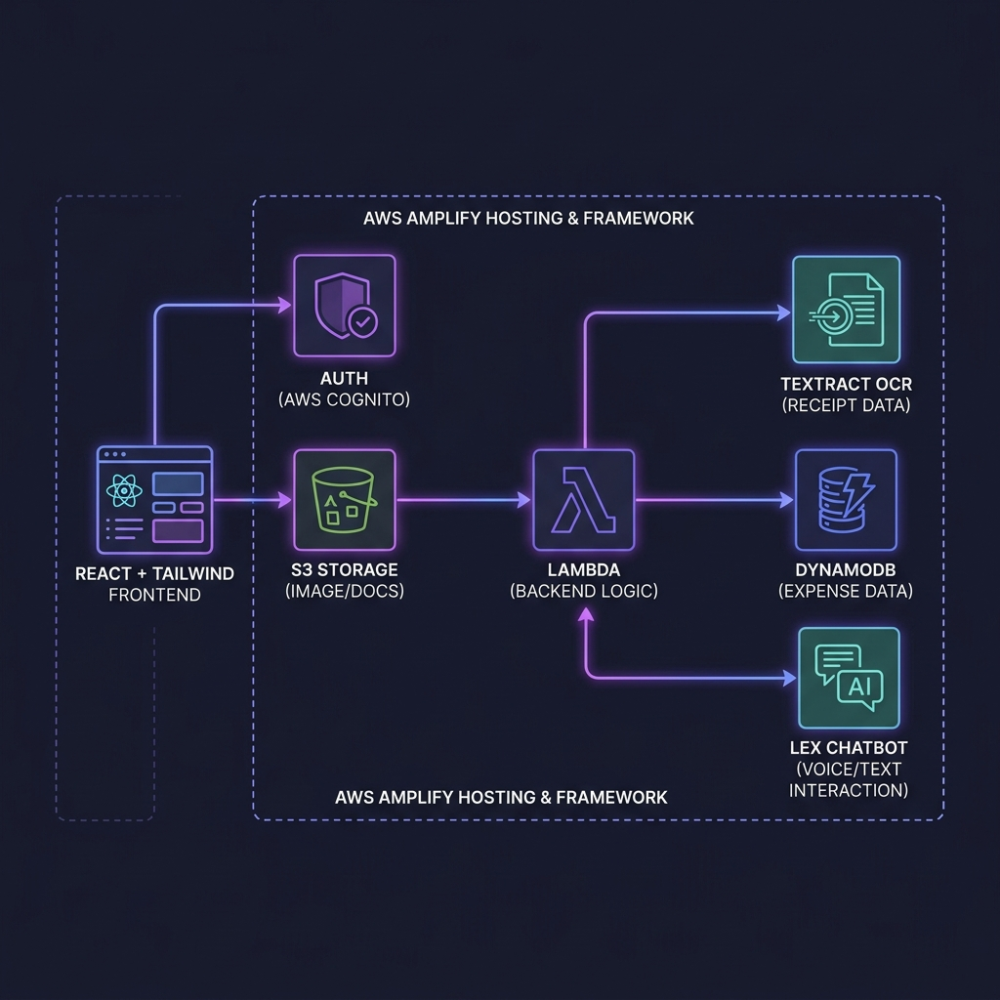

# 💰 Intelligent Expense Tracker

A **100% serverless**, AI-powered expense management system that extracts receipt data automatically using OCR. Upload a photo of any receipt and let Amazon Textract parse the merchant, date, and total — no manual data entry required.



---

## ✨ Features

- **🔐 Secure Authentication** — Email-based signup/login powered by AWS Cognito via the Amplify `<Authenticator>` wrapper.
- **📤 Drag-and-Drop Receipt Upload** — Upload `.jpg` or `.png` receipts to Amazon S3 with real-time progress tracking.
- **🤖 AI-Powered OCR** — AWS Lambda automatically triggers on upload and sends the receipt to Amazon Textract `AnalyzeExpense` to extract **Total Amount**, **Merchant Name**, and **Date**.
- **🗄️ Automatic Persistence** — Extracted data is written to DynamoDB with fallback values (`"Unknown"`) for unreadable fields — the Lambda never crashes.
- **📊 Expense Dashboard** — View all parsed receipts in a responsive, sortable table with a running total.
- **💬 AI Chatbot** — Ask natural language questions like _"How much did I spend on food?"_ via an Amazon Lex v2 chat widget.
- **🎨 Modern UI** — Built with React and Tailwind CSS featuring loading spinners, skeleton loaders, toast notifications, and responsive layouts.

---

## 🏗️ Architecture

```
┌─────────────┐     ┌──────────┐     ┌──────────┐     ┌────────────┐     ┌───────────┐
│   React +   │────▶│  AWS     │────▶│ Amazon   │────▶│   AWS      │────▶│  Amazon   │
│  Tailwind   │     │ Cognito  │     │   S3     │     │  Lambda    │     │ Textract  │
│  (Amplify)  │     │  (Auth)  │     │(Storage) │     │ (Trigger)  │     │   (OCR)   │
└─────────────┘     └──────────┘     └──────────┘     └─────┬──────┘     └───────────┘
       │                                                     │
       │            ┌──────────┐                             ▼
       └───────────▶│ Amazon   │                      ┌───────────┐
        (Chat)      │  Lex v2  │                      │ DynamoDB  │
                    │(Chatbot) │                      │(Database) │
                    └──────────┘                      └───────────┘
```

### Data Flow

1. User authenticates via **Cognito** (email + password).
2. User drops a receipt image → uploaded to **S3** via `Amplify Storage`.
3. S3 `PutObject` event triggers a **Lambda** function.
4. Lambda sends the image to **Textract** `AnalyzeExpense`.
5. Textract returns structured fields → Lambda writes to **DynamoDB**.
6. Frontend fetches expenses from DynamoDB via **GraphQL** (AppSync).
7. User can query expenses via an **Amazon Lex v2** chatbot widget.

---

## 🛠️ Tech Stack

| Layer | Technology |
|---|---|
| **Frontend** | React 19, Tailwind CSS, Lucide Icons |
| **Hosting** | AWS Amplify |
| **Auth** | Amazon Cognito (`@aws-amplify/ui-react`) |
| **Storage** | Amazon S3 (Amplify Storage) |
| **Backend** | AWS Lambda (Node.js 22.x) |
| **AI / OCR** | Amazon Textract (`AnalyzeExpense`) |
| **Database** | Amazon DynamoDB |
| **Chatbot** | Amazon Lex v2 (`@aws-sdk/client-lex-runtime-v2`) |
| **IaC** | AWS CloudFormation (via Amplify CLI) |

---

## 📁 Project Structure

```
expense-tracker/
├── amplify/                          # Amplify backend configuration
│   └── backend/
│       ├── auth/                     # Cognito user pool config
│       ├── function/
│       │   ├── S3Triggerbebbab94/    # Lambda: S3 → Textract → DynamoDB
│       │   │   └── src/index.js     # Receipt processing logic
│       │   └── processReceipt/      # Lambda: REST API scaffold
│       │       └── src/app.js
│       └── storage/                  # S3 bucket config
├── src/
│   ├── components/
│   │   ├── ChatWidget.jsx           # Floating Lex v2 chatbot
│   │   ├── Dashboard.jsx            # Sidebar + main layout
│   │   ├── ExpenseList.jsx          # GraphQL-powered expense table
│   │   └── ReceiptUploader.jsx      # Drag-and-drop S3 uploader
│   ├── App.jsx                      # Auth wrapper + routing
│   ├── main.jsx                     # React entry point
│   └── aws-exports.js               # Auto-generated Amplify config
├── docs/
│   └── architecture.png             # Architecture diagram
├── package.json
└── vite.config.js
```

---

## 🚀 Getting Started

### Prerequisites

- [Node.js](https://nodejs.org/) v18+ and npm
- [AWS CLI](https://aws.amazon.com/cli/) configured with credentials
- [Amplify CLI](https://docs.amplify.aws/cli/) v14+

```bash
npm install -g @aws-amplify/cli
amplify configure
```

### Installation

1. **Clone the repository**

```bash
git clone https://github.com/your-username/expense-tracker.git
cd expense-tracker
```

2. **Install dependencies**

```bash
npm install
```

3. **Initialize Amplify backend**

```bash
amplify init
```

4. **Add backend resources** (if not already provisioned)

```bash
amplify add auth       # Cognito — choose "Default configuration"
amplify add storage    # S3 — enable Lambda trigger
amplify add api        # GraphQL — define Expense model
amplify push           # Deploy everything to AWS
```

5. **Configure the Lambda environment**

Set the `EXPENSES_TABLE_NAME` environment variable on the `S3Triggerbebbab94` Lambda to match your DynamoDB table name (check `amplify status` for the exact name).

6. **Add Textract & DynamoDB permissions**

Create the file `amplify/backend/function/S3Triggerbebbab94/custom-policies.json`:

```json
[
  {
    "Action": ["textract:AnalyzeExpense"],
    "Resource": ["*"]
  },
  {
    "Action": ["dynamodb:PutItem", "dynamodb:GetItem", "dynamodb:UpdateItem", "dynamodb:Query"],
    "Resource": ["arn:aws:dynamodb:*:*:table/*"]
  }
]
```

Then push the changes:

```bash
amplify push
```

7. **Start the development server**

```bash
npm run dev
```

Open [http://localhost:5173](http://localhost:5173) in your browser.

---

## 🔑 Environment Variables

| Variable | Location | Description |
|---|---|---|
| `EXPENSES_TABLE_NAME` | Lambda env | DynamoDB table name for expense records |
| `VITE_LEX_BOT_ID` | `.env` (frontend) | Amazon Lex v2 Bot ID |
| `VITE_LEX_BOT_ALIAS_ID` | `.env` (frontend) | Amazon Lex v2 Bot Alias ID |

> **Note**: `aws-exports.js` is auto-generated by `amplify push` and should **not** be committed to version control (it is gitignored by default).

---

## 🧩 Key Components

### Receipt Processing Lambda (`S3Triggerbebbab94`)

The core backend logic follows a 3-step pipeline with isolated error handling:

```
S3 Event Parsing → Textract AnalyzeExpense → DynamoDB PutItem
       ↓                    ↓                       ↓
   (exit 400)         (fallback values)         (throw → retry)
```

- **Textract failure**: Saves the record with `"Unknown"` fields and a `createdAt` timestamp, so a user can manually review it later.
- **DynamoDB failure**: Throws the error so Lambda retries via the S3 event source (up to 3 attempts).
- All errors are logged with `console.error` and a `[processReceipt]` prefix for easy CloudWatch filtering.

### Frontend Toast Notifications

Both `ReceiptUploader` and `ExpenseList` provide real-time feedback via toast notifications:

- ✅ **Green toast**: Successful upload or data refresh
- ❌ **Red toast**: Upload failure, API unreachable, or invalid file type

### Chat Widget

The floating chat widget uses `@aws-sdk/client-lex-runtime-v2` directly (since `Amplify.Interactions` was removed in v6) and authenticates via `fetchAuthSession()` to obtain temporary Cognito credentials.

---

## 📸 Screenshots

> _Screenshots will be added after final UI deployment._

---

## 🗺️ Roadmap

- [ ] Add a `"Requires Manual Review"` flag for receipts where Textract couldn't detect key fields
- [ ] Implement expense categories and monthly spending charts
- [ ] Add receipt image preview in the expense table
- [ ] Export expenses to CSV / PDF
- [ ] Add multi-currency support with conversion rates
- [ ] Implement pagination for large expense lists

---

## 📄 License

This project is licensed under the [MIT License](LICENSE).

---

